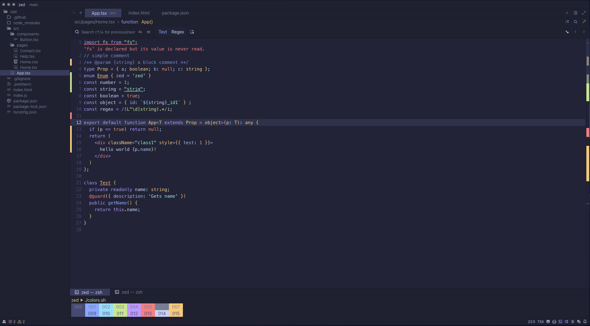
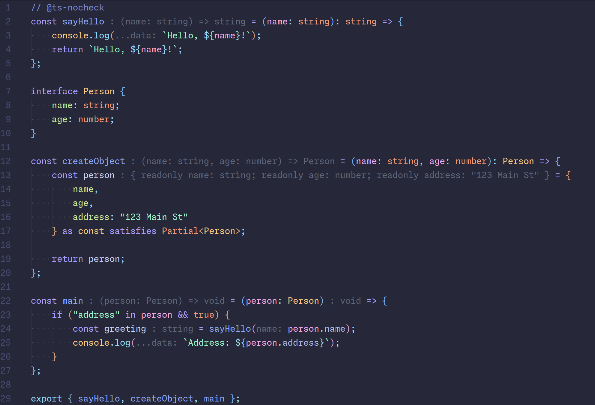
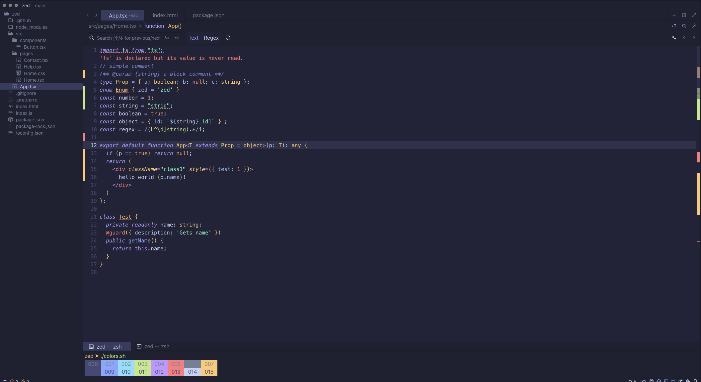

# zed-moonlight-theme

Moonlight Theme for the Zed IDE

based on https://github.com/atomiks/moonlight-vscode-theme

## Screenshots

#### Moonlight



#### Moonlight with semantic_tokens enabled



#### Moonlight Italic



## Optional Zed Settings

This is not required, but if you set `semantic_tokens` to `"combined"` in Zed's `settings.json` and add the following configuration, the colors will be closer to the original Moonlight theme.

```json
{
    // ...existing settings
    "global_lsp_settings": {
        "semantic_token_rules": [
            {
                "token_type": "parameter",
                "style": ["variable.parameter"]
            },
            {
                "token_type": "property",
                "token_modifiers": ["declaration"],
                "style": ["property.declaration"]
            },
            {
                "token_type": "type",
                "token_modifiers": ["defaultLibrary"],
                "style": ["type.defaultLibrary"]
            },
            {
                "token_type": "type",
                "token_modifiers": ["defaultLibrary"],
                "style": ["type.builtin"]
            }
        ]
    }
}
```
